# ReasoningBank MCP Server - Architecture Documentation

This document provides detailed architecture diagrams and data flow illustrations for the ReasoningBank MCP System.

## Table of Contents

- [System Architecture](#system-architecture)
- [Component Architecture](#component-architecture)
- [Data Flow Diagrams](#data-flow-diagrams)
- [Storage Architecture](#storage-architecture)
- [Deployment Architecture](#deployment-architecture)
- [Sequence Diagrams](#sequence-diagrams)

## System Architecture

### High-Level Architecture

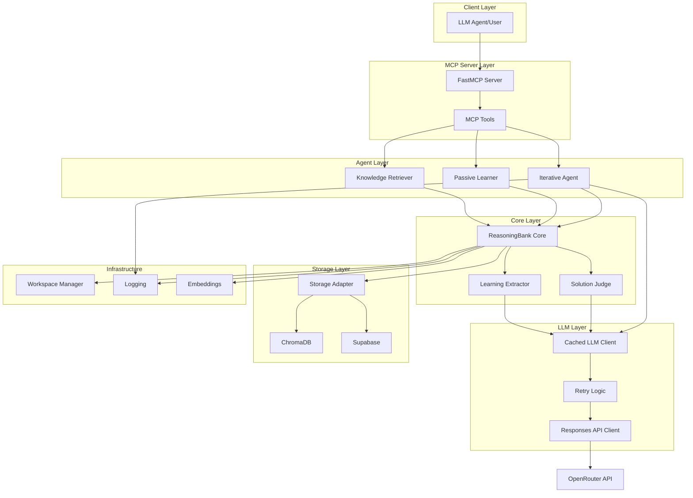
```mermaid
graph TB
    subgraph "Client Layer"
        Client[LLM Agent/User]
    end
    
    subgraph "MCP Server Layer"
        MCP[FastMCP Server]
        Tools[MCP Tools]
    end
    
    subgraph "Agent Layer"
        IA[Iterative Agent]
        PL[Passive Learner]
        KR[Knowledge Retriever]
    end
    
    subgraph "Core Layer"
        RB[ReasoningBank Core]
        Judge[Solution Judge]
        Extract[Learning Extractor]
    end
    
    subgraph "LLM Layer"
        Cache[Cached LLM Client]
        Retry[Retry Logic]
        API[Responses API Client]
    end
    
    subgraph "Storage Layer"
        SA[Storage Adapter]
        Chroma[ChromaDB]
        Supa[Supabase]
    end
    
    subgraph "Infrastructure"
        WM[Workspace Manager]
        Log[Logging]
        Embed[Embeddings]
    end
    
    Client --> MCP
    MCP --> Tools
    Tools --> IA
    Tools --> PL
    Tools --> KR
    IA --> RB
    PL --> RB
    KR --> RB
    RB --> Judge
    RB --> Extract
    RB --> SA
    IA --> Cache
    Judge --> Cache
    Extract --> Cache
    Cache --> Retry
    Retry --> API
    SA --> Chroma
    SA --> Supa
    RB --> WM
    RB --> Embed
    IA --> Log
    RB --> Log
    API --> OpenRouter[OpenRouter API]
```

### Layer Responsibilities

| Layer | Components | Responsibilities |
|-------|-----------|------------------|
| **Client** | LLM Agents, Users | Initiate requests via MCP protocol |
| **MCP Server** | FastMCP, Tools | Expose functionality as standardized tools |
| **Agent** | Iterative Agent, Passive Learner | Implement reasoning loops and learning |
| **Core** | ReasoningBank, Judge | Memory management and solution evaluation |
| **LLM** | Cache, Retry, API Client | Handle LLM communication with reliability |
| **Storage** | Adapters, Databases | Persist and retrieve memories |
| **Infrastructure** | Workspace, Logging, Embeddings | Cross-cutting concerns |

## Component Architecture

### Iterative Agent Architecture

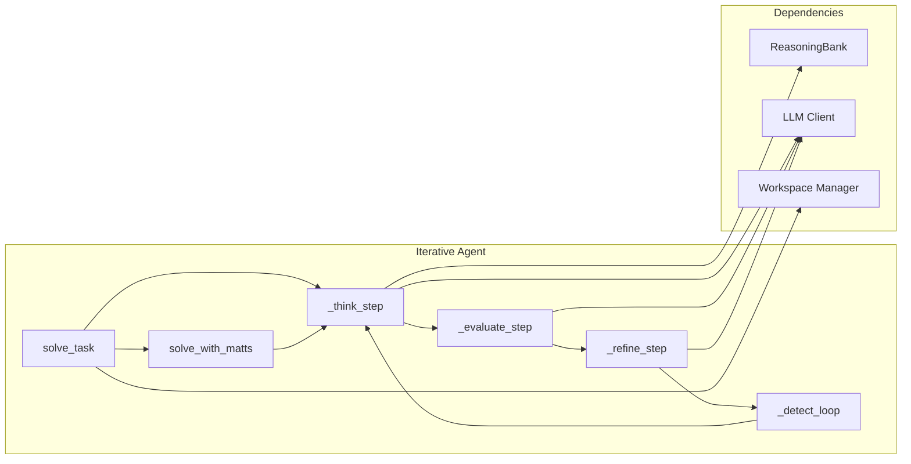
```mermaid
graph LR
    subgraph "Iterative Agent"
        Entry[solve_task]
        Think[_think_step]
        Eval[_evaluate_step]
        Refine[_refine_step]
        Loop[_detect_loop]
        MaTTS[solve_with_matts]
    end
    
    subgraph "Dependencies"
        RB[ReasoningBank]
        LLM[LLM Client]
        WM[Workspace Manager]
    end
    
    Entry --> Think
    Think --> Eval
    Eval --> Refine
    Refine --> Loop
    Loop --> Think
    Entry --> MaTTS
    MaTTS --> Think
    
    Think --> LLM
    Think --> RB
    Eval --> LLM
    Refine --> LLM
    Entry --> WM
```

### ReasoningBank Core Architecture

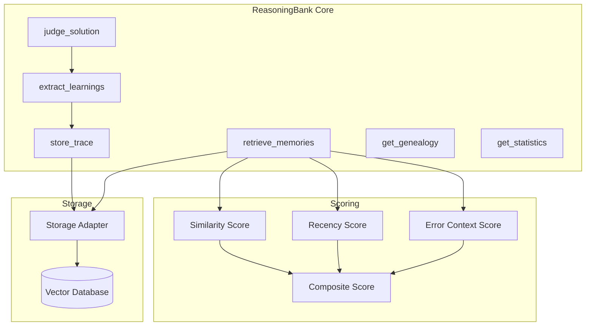
```mermaid
graph TB
    subgraph "ReasoningBank Core"
        Store[store_trace]
        Retrieve[retrieve_memories]
        Judge[judge_solution]
        Extract[extract_learnings]
        Genealogy[get_genealogy]
        Stats[get_statistics]
    end
    
    subgraph "Storage"
        SA[Storage Adapter]
        DB[(Vector Database)]
    end
    
    subgraph "Scoring"
        Sim[Similarity Score]
        Rec[Recency Score]
        Err[Error Context Score]
        Comp[Composite Score]
    end
    
    Store --> SA
    Retrieve --> SA
    SA --> DB
    
    Retrieve --> Sim
    Retrieve --> Rec
    Retrieve --> Err
    Sim --> Comp
    Rec --> Comp
    Err --> Comp
    
    Judge --> Extract
    Extract --> Store
```

### Caching Architecture

```mermaid
graph LR
    subgraph "Cached LLM Client"
        Request[API Request]
        KeyGen[Generate Cache Key]
        Check[Check Cache]
        Hit[Cache Hit]
        Miss[Cache Miss]
        Store[Store in Cache]
        Evict[LRU Eviction]
    end
    
    subgraph "Cache Storage"
        Cache[(LRU Cache)]
    end
    
    subgraph "API"
        API[Responses API]
    end
    
    Request --> KeyGen
    KeyGen --> Check
    Check --> Cache
    Check --> Hit
    Check --> Miss
    Hit --> Return[Return Cached]
    Miss --> API
    API --> Store
    Store --> Cache
    Cache --> Evict
```

## Data Flow Diagrams

### Task Solving Flow

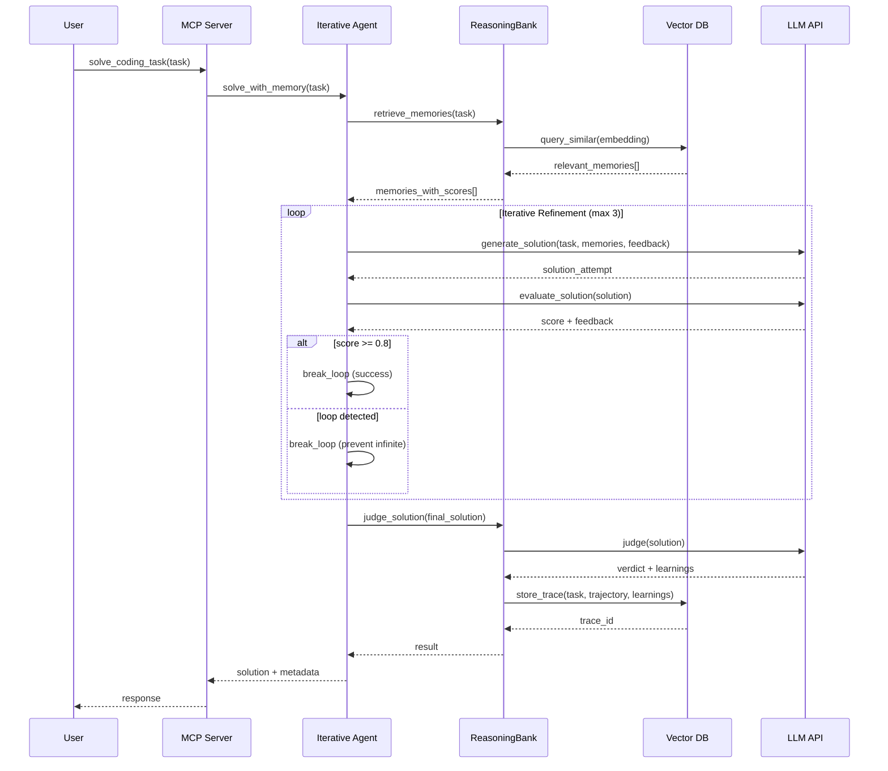
```mermaid
sequenceDiagram
    participant User
    participant MCP as MCP Server
    participant Agent as Iterative Agent
    participant Bank as ReasoningBank
    participant Storage as Vector DB
    participant LLM as LLM API
    
    User->>MCP: solve_coding_task(task)
    MCP->>Agent: solve_with_memory(task)
    
    Agent->>Bank: retrieve_memories(task)
    Bank->>Storage: query_similar(embedding)
    Storage-->>Bank: relevant_memories[]
    Bank-->>Agent: memories_with_scores[]
    
    loop Iterative Refinement (max 3)
        Agent->>LLM: generate_solution(task, memories, feedback)
        LLM-->>Agent: solution_attempt
        
        Agent->>LLM: evaluate_solution(solution)
        LLM-->>Agent: score + feedback
        
        alt score >= 0.8
            Agent->>Agent: break_loop (success)
        else loop detected
            Agent->>Agent: break_loop (prevent infinite)
        end
    end
    
    Agent->>Bank: judge_solution(final_solution)
    Bank->>LLM: judge(solution)
    LLM-->>Bank: verdict + learnings
    
    Bank->>Storage: store_trace(task, trajectory, learnings)
    Storage-->>Bank: trace_id
    
    Bank-->>Agent: result
    Agent-->>MCP: solution + metadata
    MCP-->>User: response
```

### MaTTS Parallel Flow

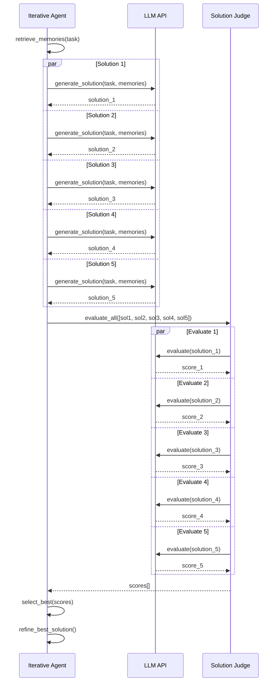
```mermaid
sequenceDiagram
    participant Agent as Iterative Agent
    participant LLM as LLM API
    participant Judge as Solution Judge
    
    Agent->>Agent: retrieve_memories(task)
    
    par Solution 1
        Agent->>LLM: generate_solution(task, memories)
        LLM-->>Agent: solution_1
    and Solution 2
        Agent->>LLM: generate_solution(task, memories)
        LLM-->>Agent: solution_2
    and Solution 3
        Agent->>LLM: generate_solution(task, memories)
        LLM-->>Agent: solution_3
    and Solution 4
        Agent->>LLM: generate_solution(task, memories)
        LLM-->>Agent: solution_4
    and Solution 5
        Agent->>LLM: generate_solution(task, memories)
        LLM-->>Agent: solution_5
    end
    
    Agent->>Judge: evaluate_all([sol1, sol2, sol3, sol4, sol5])
    
    par Evaluate 1
        Judge->>LLM: evaluate(solution_1)
        LLM-->>Judge: score_1
    and Evaluate 2
        Judge->>LLM: evaluate(solution_2)
        LLM-->>Judge: score_2
    and Evaluate 3
        Judge->>LLM: evaluate(solution_3)
        LLM-->>Judge: score_3
    and Evaluate 4
        Judge->>LLM: evaluate(solution_4)
        LLM-->>Judge: score_4
    and Evaluate 5
        Judge->>LLM: evaluate(solution_5)
        LLM-->>Judge: score_5
    end
    
    Judge-->>Agent: scores[]
    Agent->>Agent: select_best(scores)
    Agent->>Agent: refine_best_solution()
```

### Memory Retrieval Flow

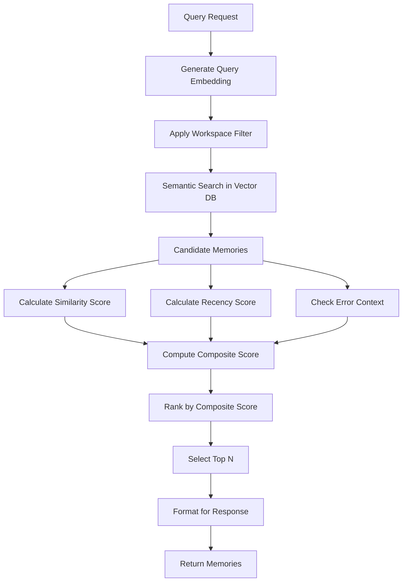
```mermaid
flowchart TD
    Start[Query Request] --> Embed[Generate Query Embedding]
    Embed --> WS[Apply Workspace Filter]
    WS --> Search[Semantic Search in Vector DB]
    Search --> Results[Candidate Memories]
    
    Results --> Sim[Calculate Similarity Score]
    Results --> Rec[Calculate Recency Score]
    Results --> Err[Check Error Context]
    
    Sim --> Comp[Compute Composite Score]
    Rec --> Comp
    Err --> Comp
    
    Comp --> Rank[Rank by Composite Score]
    Rank --> Top[Select Top N]
    Top --> Format[Format for Response]
    Format --> Return[Return Memories]
```

### Passive Learning Flow

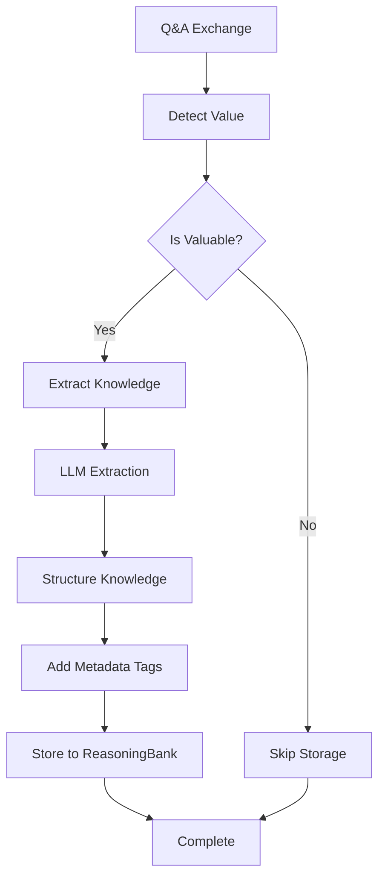
```mermaid
flowchart TD
    Start[Q&A Exchange] --> Detect[Detect Value]
    
    Detect --> Check{Is Valuable?}
    Check -->|No| Skip[Skip Storage]
    Check -->|Yes| Extract[Extract Knowledge]
    
    Extract --> LLM[LLM Extraction]
    LLM --> Structure[Structure Knowledge]
    Structure --> Tag[Add Metadata Tags]
    Tag --> Store[Store to ReasoningBank]
    Store --> End[Complete]
    Skip --> End
```

## Storage Architecture

### ChromaDB Storage Architecture

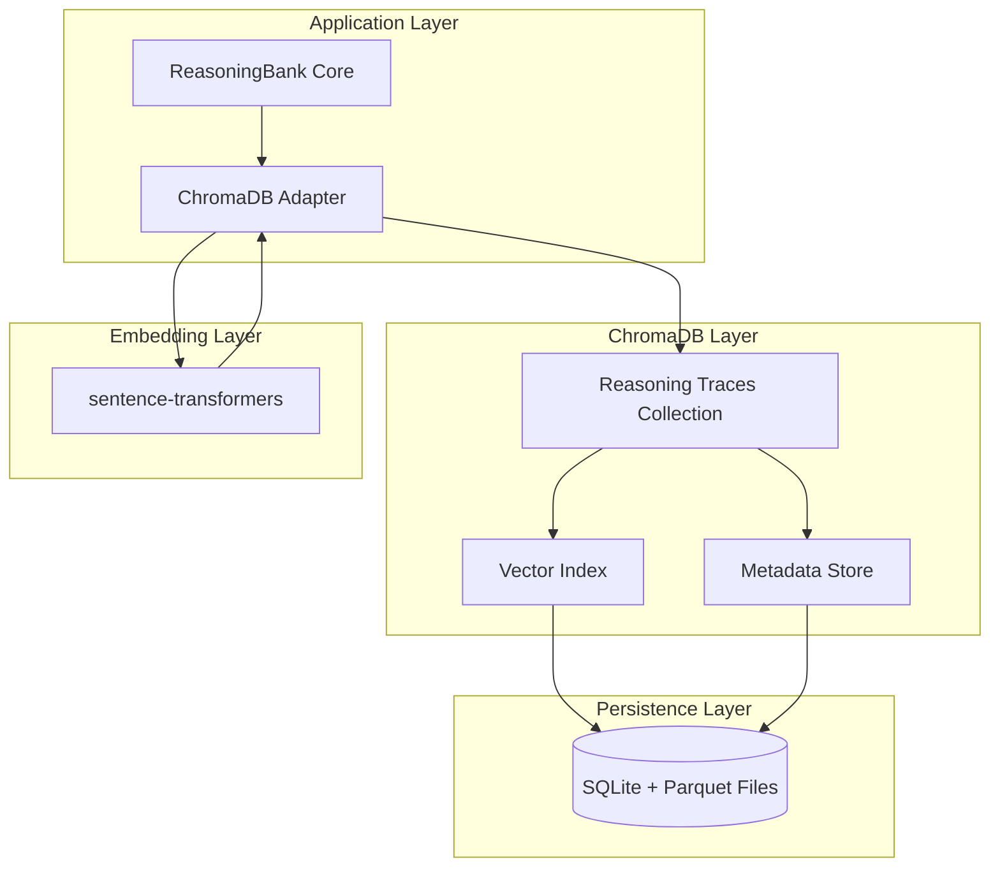
```mermaid
graph TB
    subgraph "Application Layer"
        RB[ReasoningBank Core]
        Adapter[ChromaDB Adapter]
    end
    
    subgraph "ChromaDB Layer"
        Collection[Reasoning Traces Collection]
        Index[Vector Index]
        Metadata[Metadata Store]
    end
    
    subgraph "Persistence Layer"
        Files[(SQLite + Parquet Files)]
    end
    
    subgraph "Embedding Layer"
        Model[sentence-transformers]
    end
    
    RB --> Adapter
    Adapter --> Collection
    Collection --> Index
    Collection --> Metadata
    Index --> Files
    Metadata --> Files
    
    Adapter --> Model
    Model --> Adapter
```

### Supabase Storage Architecture

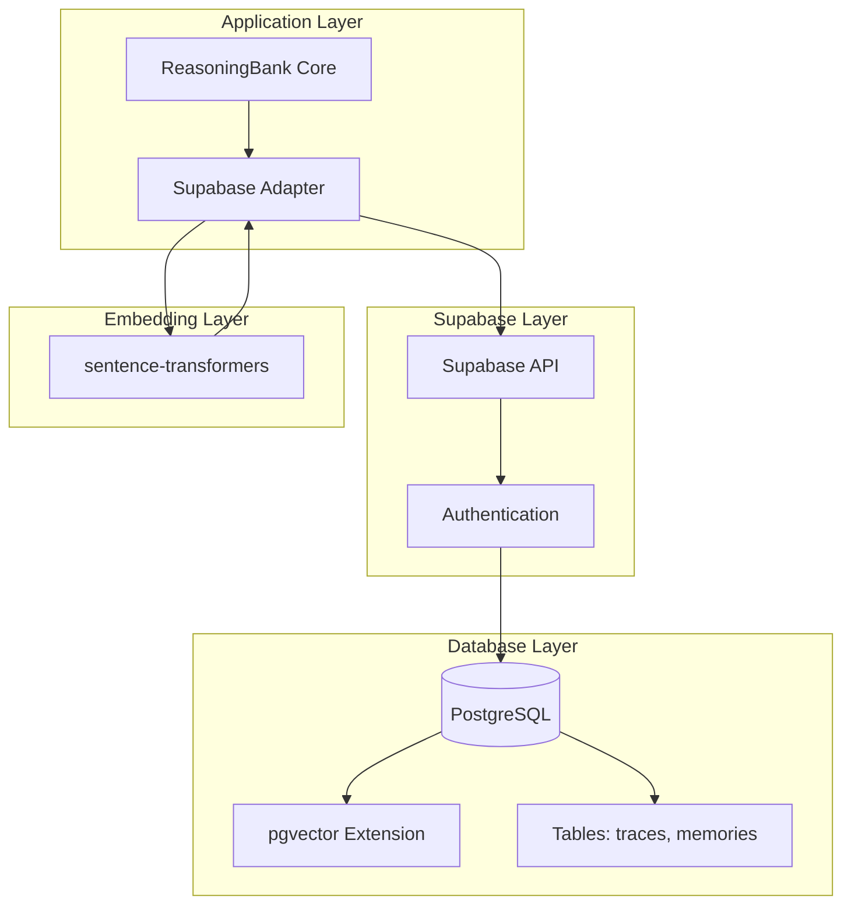
```mermaid
graph TB
    subgraph "Application Layer"
        RB[ReasoningBank Core]
        Adapter[Supabase Adapter]
    end
    
    subgraph "Supabase Layer"
        API[Supabase API]
        Auth[Authentication]
    end
    
    subgraph "Database Layer"
        PG[(PostgreSQL)]
        Vector[pgvector Extension]
        Tables[Tables: traces, memories]
    end
    
    subgraph "Embedding Layer"
        Model[sentence-transformers]
    end
    
    RB --> Adapter
    Adapter --> API
    API --> Auth
    Auth --> PG
    PG --> Vector
    PG --> Tables
    
    Adapter --> Model
    Model --> Adapter
```

### Storage Adapter Pattern

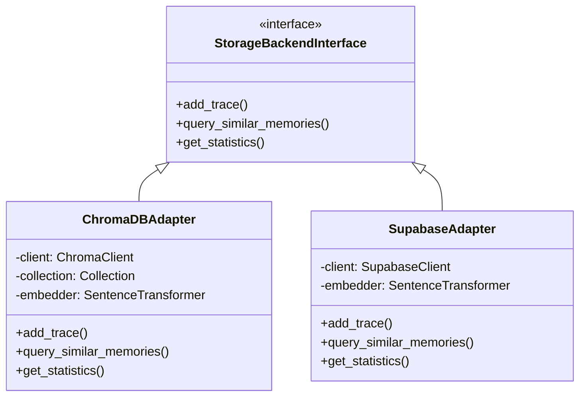
```mermaid
classDiagram
    class StorageBackendInterface {
        <<interface>>
        +add_trace()
        +query_similar_memories()
        +get_statistics()
    }
    
    class ChromaDBAdapter {
        -client: ChromaClient
        -collection: Collection
        -embedder: SentenceTransformer
        +add_trace()
        +query_similar_memories()
        +get_statistics()
    }
    
    class SupabaseAdapter {
        -client: SupabaseClient
        -embedder: SentenceTransformer
        +add_trace()
        +query_similar_memories()
        +get_statistics()
    }
    
    StorageBackendInterface <|-- ChromaDBAdapter
    StorageBackendInterface <|-- SupabaseAdapter
```

## Deployment Architecture

### Docker Deployment

```mermaid
graph TB
    subgraph "Docker Host"
        subgraph "Container: reasoning-bank-mcp"
            App[Python Application]
            Server[MCP Server]
        end
        
        subgraph "Volumes"
            ChromaVol[/chroma_data]
            TracesVol[/traces]
            LogsVol[/logs]
        end
        
        subgraph "Network"
            Port[Port 8000]
        end
    end
    
    subgraph "External"
        Client[MCP Client]
        OpenRouter[OpenRouter API]
    end
    
    App --> ChromaVol
    App --> TracesVol
    App --> LogsVol
    Server --> Port
    Client --> Port
    App --> OpenRouter
```

### Production Deployment

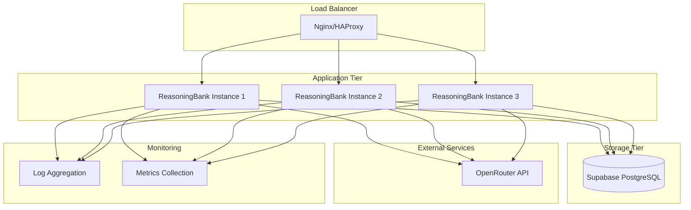
```mermaid
graph TB
    subgraph "Load Balancer"
        LB[Nginx/HAProxy]
    end
    
    subgraph "Application Tier"
        App1[ReasoningBank Instance 1]
        App2[ReasoningBank Instance 2]
        App3[ReasoningBank Instance 3]
    end
    
    subgraph "Storage Tier"
        Supabase[(Supabase PostgreSQL)]
    end
    
    subgraph "External Services"
        OpenRouter[OpenRouter API]
    end
    
    subgraph "Monitoring"
        Logs[Log Aggregation]
        Metrics[Metrics Collection]
    end
    
    LB --> App1
    LB --> App2
    LB --> App3
    
    App1 --> Supabase
    App2 --> Supabase
    App3 --> Supabase
    
    App1 --> OpenRouter
    App2 --> OpenRouter
    App3 --> OpenRouter
    
    App1 --> Logs
    App2 --> Logs
    App3 --> Logs
    
    App1 --> Metrics
    App2 --> Metrics
    App3 --> Metrics
```

## Sequence Diagrams

### Error Context Learning

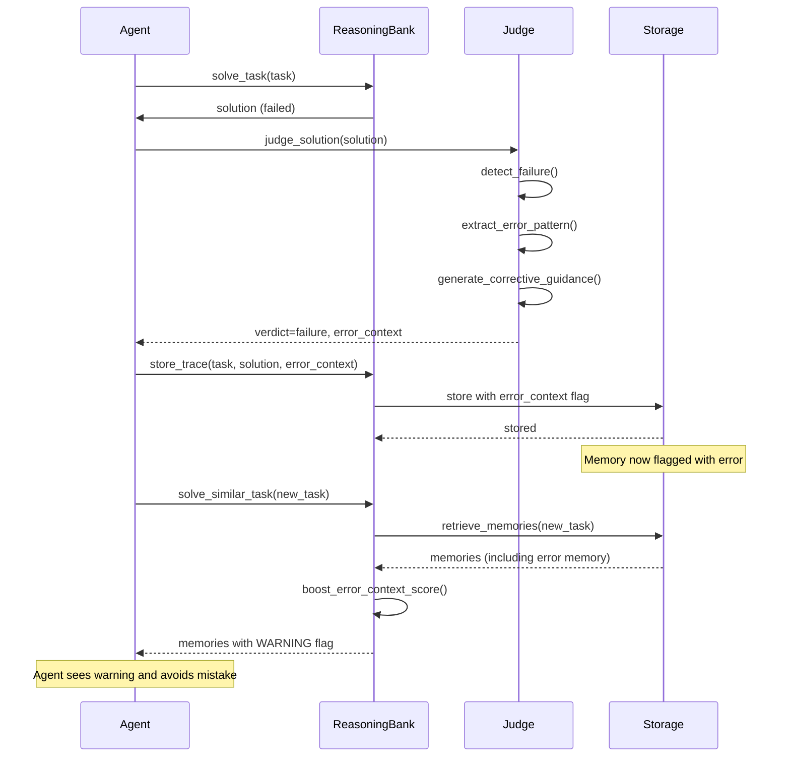
```mermaid
sequenceDiagram
    participant Agent
    participant Bank as ReasoningBank
    participant Judge
    participant Storage
    
    Agent->>Bank: solve_task(task)
    Bank->>Agent: solution (failed)
    
    Agent->>Judge: judge_solution(solution)
    Judge->>Judge: detect_failure()
    Judge->>Judge: extract_error_pattern()
    Judge->>Judge: generate_corrective_guidance()
    Judge-->>Agent: verdict=failure, error_context
    
    Agent->>Bank: store_trace(task, solution, error_context)
    Bank->>Storage: store with error_context flag
    Storage-->>Bank: stored
    
    Note over Storage: Memory now flagged with error
    
    Agent->>Bank: solve_similar_task(new_task)
    Bank->>Storage: retrieve_memories(new_task)
    Storage-->>Bank: memories (including error memory)
    Bank->>Bank: boost_error_context_score()
    Bank-->>Agent: memories with WARNING flag
    
    Note over Agent: Agent sees warning and avoids mistake
```

### Workspace Isolation

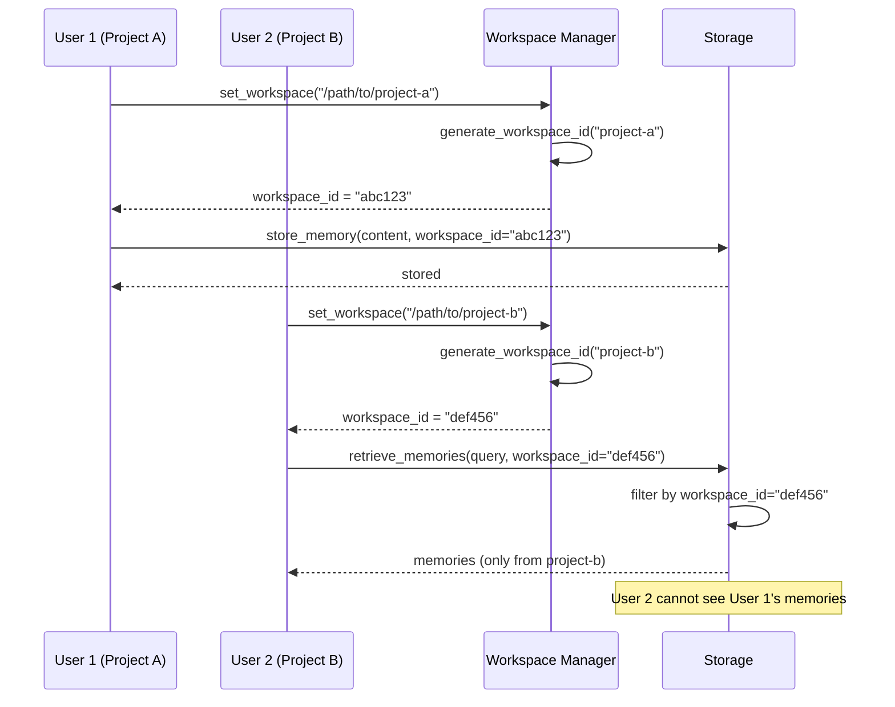
```mermaid
sequenceDiagram
    participant User1 as User 1 (Project A)
    participant User2 as User 2 (Project B)
    participant WM as Workspace Manager
    participant Storage
    
    User1->>WM: set_workspace("/path/to/project-a")
    WM->>WM: generate_workspace_id("project-a")
    WM-->>User1: workspace_id = "abc123"
    
    User1->>Storage: store_memory(content, workspace_id="abc123")
    Storage-->>User1: stored
    
    User2->>WM: set_workspace("/path/to/project-b")
    WM->>WM: generate_workspace_id("project-b")
    WM-->>User2: workspace_id = "def456"
    
    User2->>Storage: retrieve_memories(query, workspace_id="def456")
    Storage->>Storage: filter by workspace_id="def456"
    Storage-->>User2: memories (only from project-b)
    
    Note over Storage: User 2 cannot see User 1's memories
```

### Cache Hit/Miss Flow

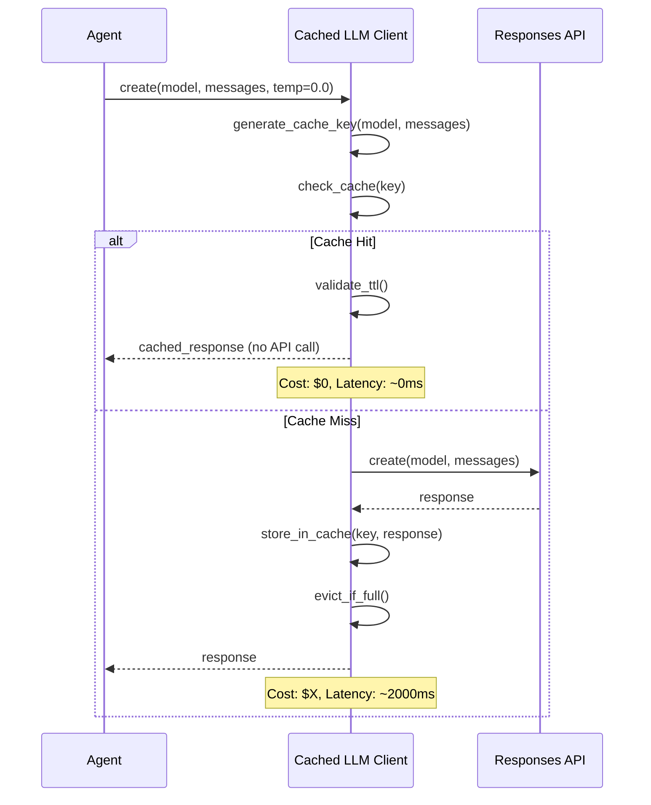
```mermaid
sequenceDiagram
    participant Agent
    participant Cache as Cached LLM Client
    participant API as Responses API
    
    Agent->>Cache: create(model, messages, temp=0.0)
    Cache->>Cache: generate_cache_key(model, messages)
    Cache->>Cache: check_cache(key)
    
    alt Cache Hit
        Cache->>Cache: validate_ttl()
        Cache-->>Agent: cached_response (no API call)
        Note over Cache: Cost: $0, Latency: ~0ms
    else Cache Miss
        Cache->>API: create(model, messages)
        API-->>Cache: response
        Cache->>Cache: store_in_cache(key, response)
        Cache->>Cache: evict_if_full()
        Cache-->>Agent: response
        Note over Cache: Cost: $X, Latency: ~2000ms
    end
```

### Retry Logic Flow

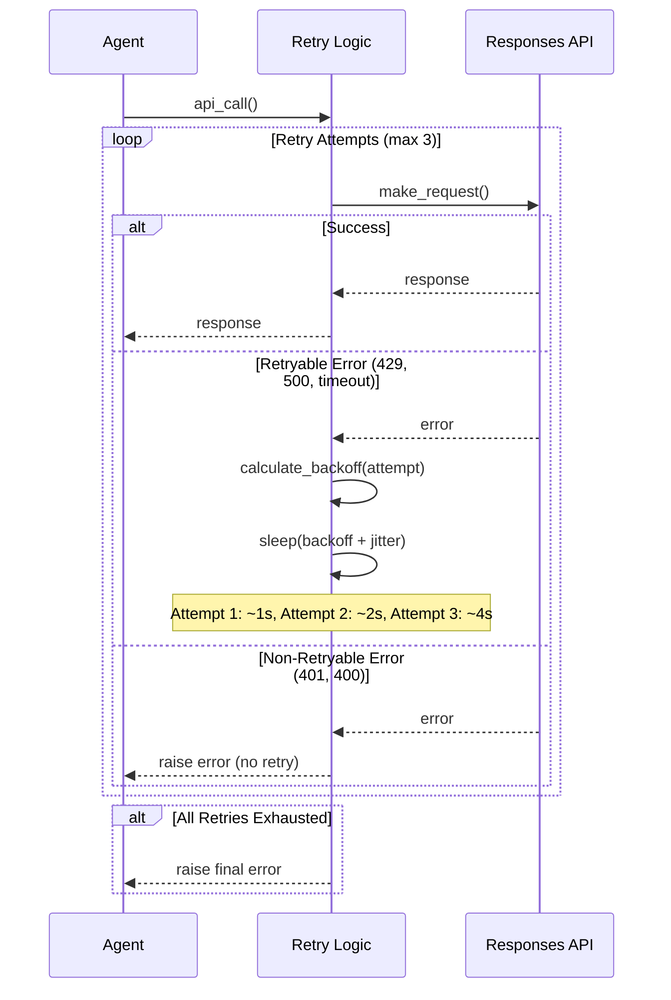
```mermaid
sequenceDiagram
    participant Agent
    participant Retry as Retry Logic
    participant API as Responses API
    
    Agent->>Retry: api_call()
    
    loop Retry Attempts (max 3)
        Retry->>API: make_request()
        
        alt Success
            API-->>Retry: response
            Retry-->>Agent: response
        else Retryable Error (429, 500, timeout)
            API-->>Retry: error
            Retry->>Retry: calculate_backoff(attempt)
            Retry->>Retry: sleep(backoff + jitter)
            Note over Retry: Attempt 1: ~1s, Attempt 2: ~2s, Attempt 3: ~4s
        else Non-Retryable Error (401, 400)
            API-->>Retry: error
            Retry-->>Agent: raise error (no retry)
        end
    end
    
    alt All Retries Exhausted
        Retry-->>Agent: raise final error
    end
```

## Data Models

### Memory Item Structure

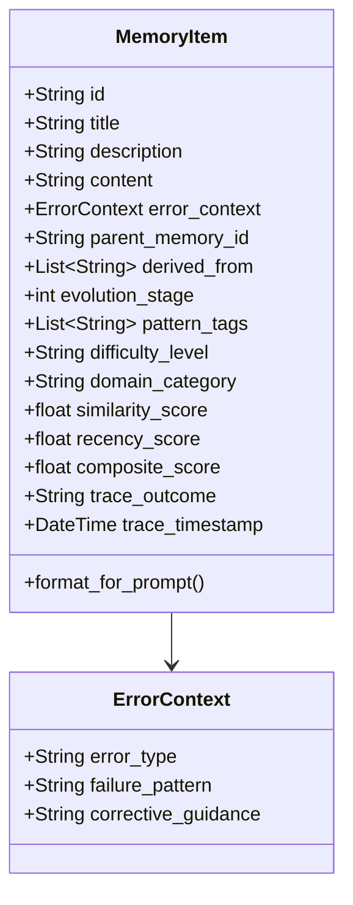
```mermaid
classDiagram
    class MemoryItem {
        +String id
        +String title
        +String description
        +String content
        +ErrorContext error_context
        +String parent_memory_id
        +List~String~ derived_from
        +int evolution_stage
        +List~String~ pattern_tags
        +String difficulty_level
        +String domain_category
        +float similarity_score
        +float recency_score
        +float composite_score
        +String trace_outcome
        +DateTime trace_timestamp
        +format_for_prompt()
    }
    
    class ErrorContext {
        +String error_type
        +String failure_pattern
        +String corrective_guidance
    }
    
    MemoryItem --> ErrorContext
```

### Reasoning Trace Structure

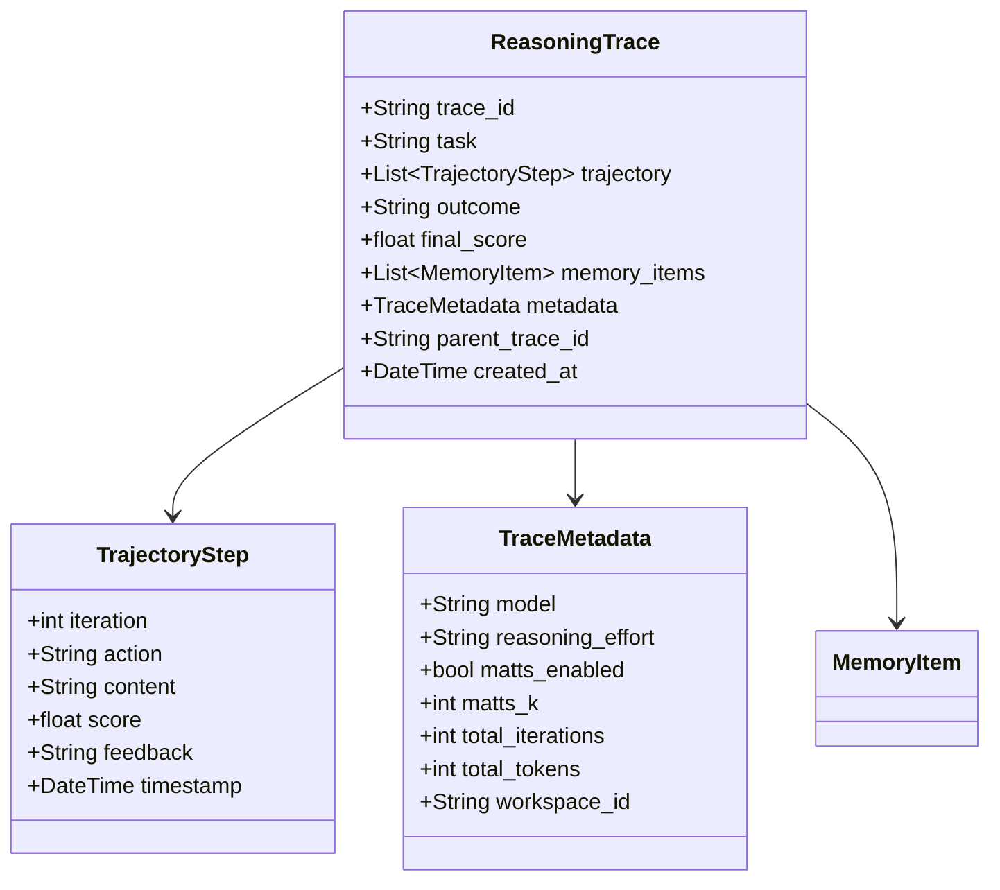
```mermaid
classDiagram
    class ReasoningTrace {
        +String trace_id
        +String task
        +List~TrajectoryStep~ trajectory
        +String outcome
        +float final_score
        +List~MemoryItem~ memory_items
        +TraceMetadata metadata
        +String parent_trace_id
        +DateTime created_at
    }
    
    class TrajectoryStep {
        +int iteration
        +String action
        +String content
        +float score
        +String feedback
        +DateTime timestamp
    }
    
    class TraceMetadata {
        +String model
        +String reasoning_effort
        +bool matts_enabled
        +int matts_k
        +int total_iterations
        +int total_tokens
        +String workspace_id
    }
    
    ReasoningTrace --> TrajectoryStep
    ReasoningTrace --> TraceMetadata
    ReasoningTrace --> MemoryItem
```

## Performance Characteristics

### Latency Breakdown

```mermaid
gantt
    title Task Solving Latency (Typical)
    dateFormat X
    axisFormat %Ls
    
    section Memory Retrieval
    Embedding Generation: 0, 200
    Vector Search: 200, 300
    Scoring & Ranking: 300, 500
    
    section Iteration 1
    Think (LLM): 500, 2500
    Evaluate (LLM): 2500, 3500
    
    section Iteration 2
    Refine (LLM): 3500, 5500
    Evaluate (LLM): 5500, 6500
    
    section Storage
    Judge (LLM): 6500, 8500
    Store Trace: 8500, 9000
```

### Cache Performance

```mermaid
pie title Cache Hit Distribution (After Warmup)
    "Cache Hits (45%)" : 45
    "Cache Misses (55%)" : 55
```

## Summary

This architecture provides:

- **Modularity**: Clear separation of concerns across layers
- **Scalability**: Pluggable storage backends and horizontal scaling
- **Reliability**: Retry logic, caching, and error handling
- **Performance**: Caching reduces costs by 20-30%, parallel MaTTS improves quality
- **Isolation**: Workspace management for multi-tenant deployments
- **Observability**: Comprehensive logging and statistics

For implementation details, see:
- [Design Document](.kiro/specs/reasoningbank-mcp-system/design.md)
- [Requirements Document](.kiro/specs/reasoningbank-mcp-system/requirements.md)
- [README.md](README.md)
